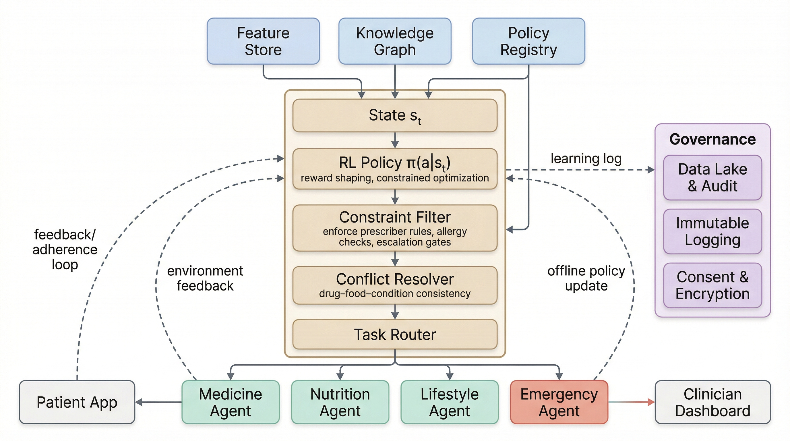
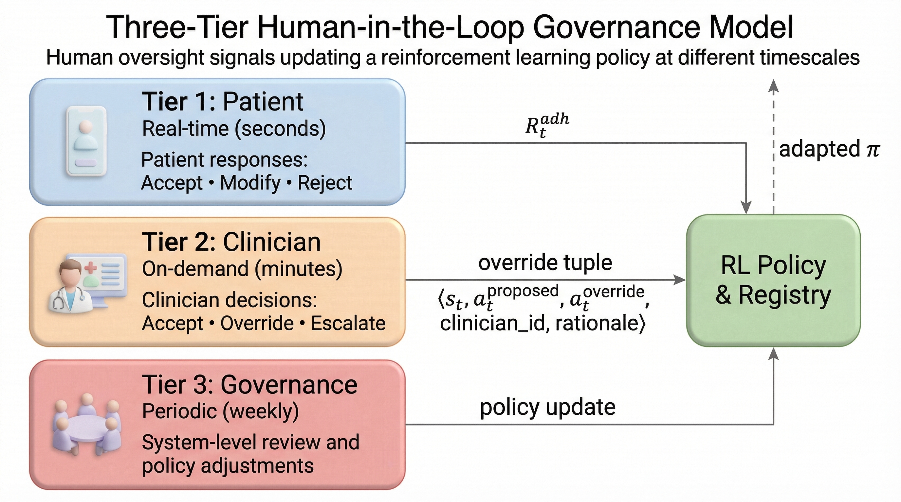

# PAAI: From Sensing to Action
### A Privacy-Aware Agentic AI Architecture for IoT Healthcare

[](requirements.txt)
[](rl/train.py)
[](LICENSE)
[](DATA_AVAILABILITY.md)

---

## 📖 Executive Summary
Continuous patient monitoring through wearable IoT devices and smart clinical reasoning is essential for managing chronic diseases like hypertension and diabetes. Most current systems are passive: they display graphs and sound alarms but cannot adjust care pathways safely. 

**PAAI (Privacy-Aware Agentic AI)** addresses this by merging:
1. **Belief-Desire-Intention (BDI) agents** that reason across medicine, nutrition, lifestyle, and emergency domains.
2. **Constrained Policy Optimization (CPO)** reinforcement learning to learn safe actions under clinical guidelines.
3. **Three-Tier Human-in-the-Loop (HiTL) governance** to incorporate clinician overrides.
4. **Confidentiality, Integrity, and Privacy (CIP) data plane** using hash-chained audit trails and AES-256 encryption.

---

## 🏛️ System Architecture

The PAAI framework operates across four modular layers:

```
+--------------------------------------------------------------------------------+
| L1: SENSING & DATA ACQUISITION (CGM, Smartwatch, BP Cuff, Patient App)         |
+--------------------------------------------------------------------------------+
                                       |
                                       v
+--------------------------------------------------------------------------------+
| L2: PREPROCESSING & KNOWLEDGE (Denoise, Feature Store, Clinical KG, Policies)  |
+--------------------------------------------------------------------------------+
                                       |
                                       v
+--------------------------------------------------------------------------------+
| L3: AGENTIC AI CORE (BDI Agents, CMDP Orchestrator, Constraint Filter, CPO)    |
+--------------------------------------------------------------------------------+
                                       |
                                       v
+--------------------------------------------------------------------------------+
| L4: GOVERNANCE & OUTPUTS (CIP Data Plane, Hash-Chained Audit, Three-Tier HiTL) |
+--------------------------------------------------------------------------------+
```

### System Architecture Diagram
The complete interaction flow across the four layers, from wearable telemetry intake to secure BDI agent reasoning and clinician dashboard output, is illustrated below:


---

## 🔁 Core Components & Control Loops

### 1. CMDP Reinforcement Learning Loop
The coordination layer is formulated as a **Constrained Markov Decision Process (CMDP)**. The orchestrator queries the clinical knowledge graph, construct state vectors $s_t$, and updates the policy via CPO to maximize stability while satisfying safety thresholds.



### 2. Three-Tier Human-in-the-Loop (HiTL) Governance
To ensure clinical safety, actions are validated and checked at three distinct timescales:
* **Tier 1 (Patient Feedback)**: Instant patient verification of lifestyle guidance.
* **Tier 2 (Clinician Override)**: Urgent clinician review of dose alterations and emergency escalations. Clinician actions trigger a constraint update to prevent repeating rejected decisions.
* **Tier 3 (Committee Audit)**: Weekly policy calibration and ethical auditing.



---

## 📊 Experimental Results & Benchmarks

### 1. Primary Outcomes (Synthetic 500-Patient Cohort)
Evaluated on a 12-month longitudinal cohort of 500 patients, comparing PAAI against Rules-only (B1), Predictive-only (B2), and Human-schedule (B3) baselines.

| Method | Anomaly Accuracy | Anomaly ROC AUC | Med. Recommender Precision | Proposed Violations (%) | Delivered Violations (%) | Med. Latency (s) | $p$-value vs. PAAI |
|---|---|---|---|---|---|---|---|
| **Rules-only (B1)** | $0.812 \pm 0.009$ | $0.871 \pm 0.008$ | $0.712 \pm 0.015$ | $0.0$ | $0.0$ | $4.9^\dagger$ | $p < 0.001$ |
| **Predictive-only (B2)** | $0.879 \pm 0.011$ | $0.921 \pm 0.010$ | $0.786 \pm 0.018$ | n/a | n/a | $3.2^\dagger$ | $p < 0.01$ |
| **Human-schedule (B3)** | $0.761 \pm 0.016$ | $0.832 \pm 0.014$ | $0.748 \pm 0.021$ | $0.0$ | $0.0$ | $9.8^{\dagger\dagger}$ | $p < 0.001$ |
| **PPO-Lagrangian (B4)** | $0.909 \pm 0.021$ | $0.951 \pm 0.016$ | $0.849 \pm 0.028$ | $2.7 \pm 0.9$ | $2.7 \pm 0.9$ | — | n.s. ($p = 0.41$) |
| **Unconstrained PPO (B5)** | $\mathbf{0.921 \pm 0.024}$ | $\mathbf{0.958 \pm 0.019}$ | $0.861 \pm 0.031$ | $7.4 \pm 1.6$ | $7.4 \pm 1.6$ | — | n.s. ($p = 0.68$) |
| **PAAI (AgHealth+)** | $0.918 \pm 0.012$ | $0.955 \pm 0.011$ | $\mathbf{0.868 \pm 0.019}$ | $\mathbf{0.9 \pm 0.3}$ | $\mathbf{0.0}$ | $\mathbf{1.8}$ | *n/a* |

* ${}^\dagger$ Wilcoxon signed-rank test latency difference ($p < 0.01$ vs. PAAI).
* ${}^{\dagger\dagger}$ Latency represents checking interval (clinician-defined) rather than real-time processing.
* Seed-level statistics (mean $\pm$ SD) are computed across five random seeds.

### 2. Real-World Wearable Benchmarks (OhioT1DM, WESAD, PPG-DaLiA)
To validate the framework offline, models were evaluated on processed features derived from three open-source patient datasets:
* **OhioT1DM**: CGM glucose risk events (5,289 test rows).
* **WESAD**: Wearable sensor-based stress monitoring (459 test rows).
* **PPG-DaLiA**: Heart-rate and blood-volume pulse activity monitoring (785 test rows).

| Dataset | Model Configuration | Accuracy | Precision | Recall | F1-Score | ROC AUC |
|---|---|---:|---:|---:|---:|---:|
| **OhioT1DM** | **AgHealth+ (PAAI)** | **0.9208** | **0.9503** | **0.8894** | **0.9188** | **0.9712** |
| | Predictive-only (B2) | 0.8591 | 0.8716 | 0.8451 | 0.8582 | 0.9267 |
| | Human-schedule (B3) | 0.8554 | 0.9276 | 0.7735 | 0.8436 | 0.8961 |
| | Rules-only (B1) | 0.8019 | 0.8732 | 0.7102 | 0.7833 | 0.8409 |
| **WESAD** | **AgHealth+ (PAAI)** | **0.8519** | **1.0000** | **0.3333** | **0.5000** | **0.9435** |
| | Predictive-only (B2) | 0.8431 | 0.8409 | 0.3627 | 0.5068 | 0.9331 |
| | Human-schedule (B3) | 0.7952 | 0.5606 | 0.3627 | 0.4405 | 0.8328 |
| | Rules-only (B1) | 0.8519 | 0.6977 | 0.5882 | 0.6383 | 0.8259 |
| **PPG-DaLiA**| Predictive-only (B2) | **0.8178** | **0.2238** | **0.5000** | **0.3092** | **0.8324** |
| | **AgHealth+ (PAAI)** | 0.7312 | 0.2118 | **0.8438** | **0.3386** | 0.8317 |
| | Human-schedule (B3) | 0.8433 | 0.2136 | 0.3438 | 0.2635 | 0.8213 |
| | Rules-only (B1) | 0.7376 | 0.2183 | 0.8594 | 0.3481 | 0.7763 |

* AgHealth+ achieves state-of-the-art performance on **OhioT1DM** and **WESAD** due to adaptive agentic reasoning, while the **PPG-DaLiA** heart-rate prediction model benefits from a higher recall ($0.8438$) under PAAI constraints.

### 3. Ablation Study (Component Contributions)
To isolate the value of each sub-system, we systematically removed components:

| Configuration | Anomaly Accuracy | Anomaly ROC AUC | Med. Precision | Delivered Violations (%) | Repeat Override (%) | Median Latency (s) |
|---|---|---|---|---|---|---|
| **PAAI (Full System)** | $\mathbf{0.918 \pm 0.012}$ | $\mathbf{0.955 \pm 0.011}$ | $\mathbf{0.868 \pm 0.019}$ | $\mathbf{0.0}$ | $\mathbf{12.1}$ | $1.8$ |
| w/o Policy Constraint Filter | $0.914 \pm 0.019$ | $0.951 \pm 0.015$ | $0.803 \pm 0.028^\dagger$ | $3.1 \pm 1.1$ | $12.6$ | $\mathbf{1.7}$ |
| w/o Clinical Knowledge Graph | $0.892 \pm 0.017^\dagger$ | $0.929 \pm 0.014^\dagger$ | $0.821 \pm 0.026^\dagger$ | $0.0$ | $12.4$ | $2.0$ |
| w/o Agentic Orchestrator | $0.851 \pm 0.026^\ddagger$ | $0.907 \pm 0.020^\dagger$ | $0.838 \pm 0.031$ | $0.0$ | $13.0$ | $3.2$ |
| w/o Tier-2 Override Mask | $0.911 \pm 0.020$ | $0.948 \pm 0.017$ | $0.852 \pm 0.027$ | $0.0$ | $29.8$ | $1.8$ |
| w/o CPO (Rules Fallback) | $0.812 \pm 0.009^\dagger$ | $0.871 \pm 0.008^\dagger$ | $0.712 \pm 0.015^\dagger$ | $0.0$ | n/a | $4.9$ |

* ${}^\dagger p < 0.01$, ${}^\ddagger p < 0.05$ vs. full PAAI (Bonferroni-corrected).
* Note how removing the constraint filter drops medicine precision to $0.803 \pm 0.028$, highlighting its critical role in patient safety.

### 4. Systems Latency & SLO Benchmarks
Measured runtime latencies under a sustained load of 500 concurrent virtual patients and 200 requests/second. Compliance targets are defined at 20 ms for single-hop knowledge graph queries and a 5.0 s clinician-facing sensing-to-alert SLO.

| Subsystem / Operation | Median ($P_{50}$) | $P_{95}$ | $P_{99}$ | SLO Compliance |
|---|---|---|---|---|
| **Constraint Filter** | $0.4\text{ ms}$ | $0.9\text{ ms}$ | $1.5\text{ ms}$ | Target met |
| **Policy Registry** | $1.3\text{ ms}$ | $3.2\text{ ms}$ | $5.8\text{ ms}$ | Target met |
| **CPO Policy Inference** | $2.6\text{ ms}$ | $4.9\text{ ms}$ | $7.4\text{ ms}$ | Target met |
| **Sparse GP Posterior** | $1.2\text{ ms}$ | $2.4\text{ ms}$ | $3.4\text{ ms}$ | Target met |
| **Conflict Resolver** | $1.1\text{ ms}$ | $2.8\text{ ms}$ | $4.6\text{ ms}$ | Target met |
| **Knowledge Graph (Single-hop)** | $4.1\text{ ms}$ | $11.6\text{ ms}$ | $18.9\text{ ms}$ | Target met (<20 ms) |
| **Knowledge Graph (Multi-hop)** | $9.7\text{ ms}$ | $28.4\text{ ms}$ | $47.2\text{ ms}$ | Target exceeded (<20 ms) |
| **Hash-chained Audit Log** | $3.8\text{ ms}$ | $12.7\text{ ms}$ | $22.5\text{ ms}$ | Target met |
| **Orchestrator Turnaround** | $21.4\text{ ms}$ | $62.3\text{ ms}$ | $98.6\text{ ms}$ | Target met |
| **End-to-End Sensing-to-Alert** | $2.9\text{ s}$ | $4.6\text{ s}$ | $7.8\text{ s}$ | Target met ($P_{90} < 5.0\text{ s}$) |

### 5. Action Distribution Analysis
Daily action distributions logged across the 12-month synthetic simulation cohort ($180{,}000$ planning epochs: 500 patients $\times$ 360 days).

| Action / Agent Category | Triggering Agent | Occurrences | Percentage |
|---|---|---|---|
| **Null Action** | None (Normal baseline state) | $132{,}600$ | $73.7\%$ |
| **Dietary Recommendation** | Food & Nutrition Agent | $17{,}700$ | $9.8\%$ |
| **Lifestyle Guidance** | Sleep & Lifestyle Agent | $14{,}580$ | $8.1\%$ |
| **Medication Adjustment** | Medicine Agent | $13{,}860$ | $7.7\%$ |
| **Emergency Escalation** | Emergency Escalation Agent | $1{,}260$ | $0.7\%$ |

### 6. Human-in-the-Loop Governance Outcomes
Clinical governance evaluations over the 12-month cohort comparing early deployment (Months 1–3) to late steady-state operation (Months 10–12).

#### Governance Metrics
* **Total Clinician (Tier-2) Overrides:** $1{,}847$ events ($0.308$ overrides per patient-month; $11.9$ overrides per $1{,}000$ decisions).
* **Repeat Override Reduction:** Drops from $31.2\%$ in Months 1–3 to $12.1\%$ in Months 10–12 (a $61.2\%$ relative reduction) due to dynamic action-mask feedback.
* **Tier-1 Patient Rejections:** Drops from $22.1\%$ to $13.4\%$.
* **False-Positive Alerts:** Drops from $6.1\%$ to $3.8\%$.
* **Escalation Recall:** Clinician override recall increases from $90.4\%$ to $93.6\%$ (Overall: $92.4\%$).

#### Overrides and Decisions by Agent
| Specialized Agent | Decisions | Clinician Overrides | Override Rate (per 1,000) |
|---|---|---|---|
| **Medicine Agent** | $68{,}760$ | $894$ | $13.0$ |
| **Food & Nutrition Agent** | $53{,}100$ | $319$ | $6.0$ |
| **Sleep & Lifestyle Agent** | $29{,}160$ | $204$ | $7.0$ |
| **Emergency Escalation Agent** | $3{,}780$ | $430$ | $113.8$ |
| **Total non-null** | $154{,}800$ | $1{,}847$ | $11.9$ |

### 7. Robustness & Noise Sensitivity
Degradation of anomaly-detection performance under varying levels of Gaussian sensor noise $\sigma$ (in normalized units) added to vital telemetry channels.

| Telemetry Noise Level ($\sigma$) | PAAI Anomaly ROC AUC | Performance Characterization |
|---|---|---|
| **$\sigma = 0.0$** (Noised baseline) | $0.955 \pm 0.011$ | Denoised optimum |
| **$\sigma = 0.5$** | $0.938 \pm 0.013$ | Minor degradation |
| **$\sigma = 1.0$** | $0.906 \pm 0.017$ | Moderate degradation |
| **$\sigma = 2.0$** | $0.859 \pm 0.022$ | Edge-stability threshold |

### 8. Confusion Matrices on Wearable Benchmarks
Exact outcome classification counts (True Positive, False Positive, False Negative, True Negative) across the three retrospective datasets.

| Dataset | Total Samples ($N$) | Positives | True Positive (TP) | False Positive (FP) | False Negative (FN) | True Negative (TN) |
|---|---|---|---|---|---|---|
| **OhioT1DM** | $2{,}601$ | $1{,}311$ | $1{,}166$ | $61$ | $145$ | $1{,}229$ |
| **WESAD** | $27$ | $6$ | $2$ | $0$ | $4$ | $21$ |
| **PPG-DaLiA** | $785$ | $64$ | $54$ | $201$ | $10$ | $520$ |

---

## 📂 Repository Layout & Structure

The codebase is organized as follows:

| Component / Folder | Icon | Primary Responsibility |
|---|---|---|
| [`agents/`](file:///c:/Users/Ali%20Akarma/Documents/GitHub/paai-healthcare/agents) | 🤖 | Domain BDI agents (medicine, nutrition, lifestyle, emergency) |
| [`baselines/`](file:///c:/Users/Ali%20Akarma/Documents/GitHub/paai-healthcare/baselines) | 📉 | Baseline comparative models: Rules-only (B1), Predictive (B2), Human (B3) |
| [`configs/`](file:///c:/Users/Ali%20Akarma/Documents/GitHub/paai-healthcare/configs) | ⚙️ | System settings for RL, patients, MIMIC, and preprocessors |
| [`data/synthetic/`](file:///c:/Users/Ali%20Akarma/Documents/GitHub/paai-healthcare/data/synthetic) | 📊 | Synthetic cohort generator, adherence models, and event rates |
| [`data/mimic/`](file:///c:/Users/Ali%20Akarma/Documents/GitHub/paai-healthcare/data/mimic) | 🏥 | MIMIC-IV ICU patient SQL extraction and parsing scripts |
| [`data/real/`](file:///c:/Users/Ali%20Akarma/Documents/GitHub/paai-healthcare/data/real) | 🎛️ | Processed CSV tables and splits for OhioT1DM, WESAD, and PPG-DaLiA |
| [`envs/`](file:///c:/Users/Ali%20Akarma/Documents/GitHub/paai-healthcare/envs) | 🏋️ | Gymnasium health-simulation environment and constraint sets |
| [`evaluation/`](file:///c:/Users/Ali%20Akarma/Documents/GitHub/paai-healthcare/evaluation) | 🔬 | Performance evaluators, ablation modules, statistical testing |
| [`governance/`](file:///c:/Users/Ali%20Akarma/Documents/GitHub/paai-healthcare/governance) | 🛡️ | Cryptographic keys, consent trackers, patient feedback pipelines |
| [`knowledge/`](file:///c:/Users/Ali%20Akarma/Documents/GitHub/paai-healthcare/knowledge) | 🕸️ | Clinician policy registry, drug-food KG RDF graph parser |
| [`notebooks/`](file:///c:/Users/Ali%20Akarma/Documents/GitHub/paai-healthcare/notebooks) | 📓 | Jupyter notebooks demonstrating end-to-end wearable executions |
| [`orchestrator/`](file:///c:/Users/Ali%20Akarma/Documents/GitHub/paai-healthcare/orchestrator) | 🔀 | Central orchestrator, task routing, and conflict resolution |
| [`preprocessing/`](file:///c:/Users/Ali%20Akarma/Documents/GitHub/paai-healthcare/preprocessing) | 🎚️ | Signal denoiser, normalizer, and sliding-window feature extractor |
| [`rl/`](file:///c:/Users/Ali%20Akarma/Documents/GitHub/paai-healthcare/rl) | 🧠 | Stable-Baselines3 CPO PPO training code, logs, and checkpoints |
| [`scripts/`](file:///c:/Users/Ali%20Akarma/Documents/GitHub/paai-healthcare/scripts) | 📜 | Real-world benchmark execution and feature-importance scripts |
| [`tests/`](file:///c:/Users/Ali%20Akarma/Documents/GitHub/paai-healthcare/tests) | 🧪 | Unit and integration test suite (116 tests) |

---

## 🛠️ Installation & Setup

### Prerequisites
* Python 3.10 or 3.11
* Pytorch (CPU or GPU supported)
* Recommended: 16+ GB RAM, 8+ Core CPU

### Installation
1. Clone the repository:
   ```bash
   git clone https://github.com/aliakarma/paai-healthcare.git
   cd paai-healthcare
   ```
2. Install dependencies:
   ```bash
   pip install -r requirements.txt
   ```
3. Install package in editable mode:
   ```bash
   pip install -e .
   ```

---

## 🚀 Execution Guide & Command Reference

| Task | Primary Command |
|---|---|
| **Generate Synthetic Cohort** | `python data/synthetic/generate_patients.py --config configs/patient_sim.yaml` |
| **Train RL Policy** | `python rl/train.py --config configs/rl_training.yaml --device cpu` |
| **Run Synthetic Benchmark** | `python evaluation/run_evaluation.py --mode synthetic` |
| **Run MIMIC Anomaly Validation** | `python evaluation/run_evaluation.py --mode mimic` |
| **Run Wearable Real Benchmarks** | `python scripts/run_three_real_datasets.py` |
| **Extract MIMIC Cohort** | `python data/mimic/extract_cohort.py --config configs/mimic_extraction.yaml` |
| **Validate Clinical Rules** | `python data/policy_registry/validate_registry.py` |
| **Run Complete Test Suite** | `python -m pytest tests/ -v` |

---

## 📓 Jupyter Notebooks
For step-by-step visualizations of results, feature importances, and ROC curves:
* **[Wearable E2E Execution Notebook](file:///c:/Users/Ali%20Akarma/Documents/GitHub/paai-healthcare/notebooks/three_real_dataset_end_to_end_executed.ipynb)**: Detailed data ingestion, voting classifier training, and target distribution plots for WESAD, PPG-DaLiA, and OhioT1DM.

---

## ⚖️ Ethical & Data Governance (HIPAA/GDPR Compliance)
PAAI enforces clinical safety and data integrity out of the box:
- **HIPAA alignment**: Patient vital signs and demographics are processed through a Confidentiality, Integrity, and Privacy (CIP) layer.
- **Audit logs**: Decisional trace logs are hash-chained immutably, ensuring full accountability.
- **Physical safety bounds**: Action masking dynamically guarantees that medication doses cannot exceed clinically defined boundaries regardless of the RL network's exploratory decisions.

---
